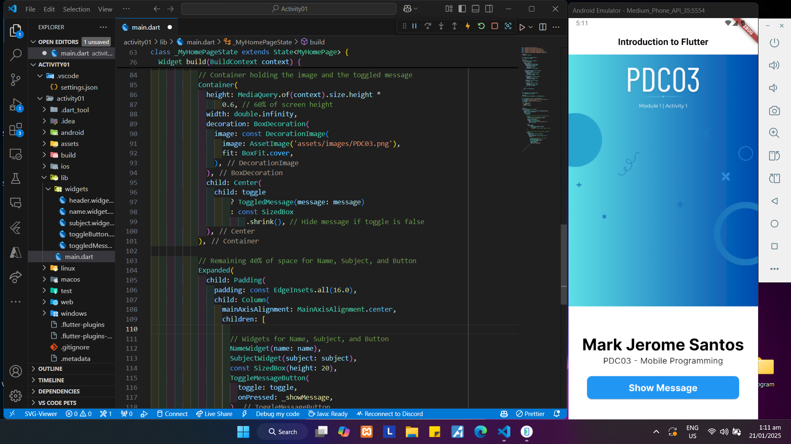
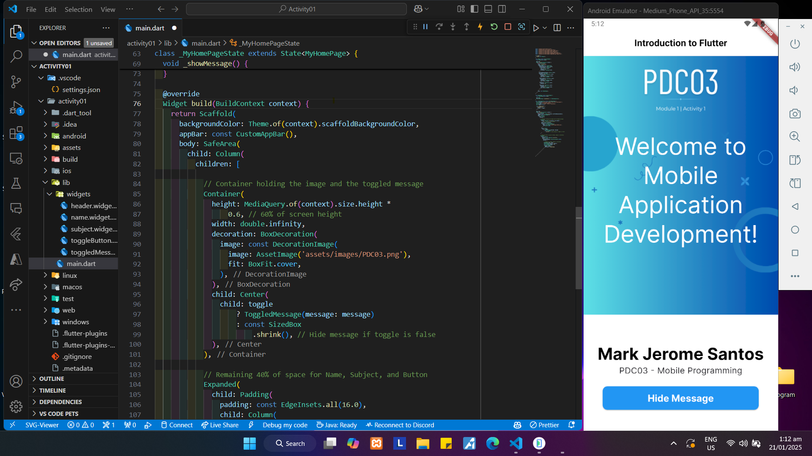
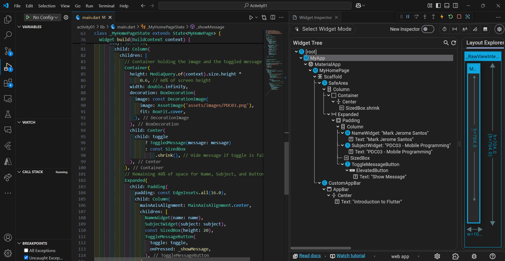
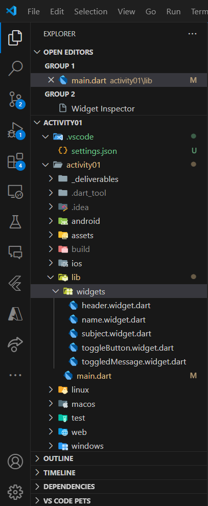

# Repository Details

This repository contains the source code and required deliverables for various activities. Each folder (e.g., `activity01`) is dedicated to a specific activity, ensuring modularity and organization. 

All required deliverables, such as screenshots, are stored in the `_deliverables` subfolder within each activity folder.

---

## Table of Contents

- [Repository Details](#repository-details)
- [Table of Contents](#table-of-contents)
- [Activities](#activities)
  - [Module 1 - Activity 01](#module-1---activity-01)
    - [Activity 1 Widgets Overview](#activity-1-widgets-overview)
    - [Activity 1 File Structure](#activity-1-file-structure)
  - [Module 2 - Activity 02](#module-2---activity-02)
- [Authors](#authors)

---

## Activities

### Module 1 - Activity 01






---

### Activity 1 Widgets Overview

The app's widgets are organized under `lib/widgets` for better modularity and reusability. Below is an overview of each widget and its role in the application:

#### 1. `header.widget.dart`
- **Purpose**: Defines a custom app bar (`CustomAppBar`) for consistent header styling.
- **Key Features**:
  - Displays the app title.
  - Follows the theme defined in `main.dart`.
- **Usage**: Imported and used in `MyHomePage` as the app bar.

#### 2. `name.widget.dart`
- **Purpose**: Displays the user’s name using the `NameWidget`.
- **Key Features**:
  - Accepts a `name` parameter.
  - Styled to align with the app’s text theme.
- **Usage**: Used in the `MyHomePage` to show the user’s name.

#### 3. `subject.widget.dart`
- **Purpose**: Displays the subject information using the `SubjectWidget` *(e.g., PDC03 - Mobile Programming)*.
- **Key Features**:
  - Accepts a `subject` parameter.
  - Styled for clear visibility.
- **Usage**: Used in the `MyHomePage` to show the subject.

#### 4. `toggleButton.widget.dart`
- **Purpose**: Provides a button (`ToggleMessageButton`) to toggle the visibility of a message.
- **Key Features**:
  - Accepts a `toggle` state and an `onPressed` callback.
  - Updates UI dynamically when clicked.
- **Usage**: Placed in the `MyHomePage` to control the visibility of the `ToggledMessage`.

#### 5. `toggledMessage.widget.dart`
- **Purpose**: Displays a message dynamically based on the toggle state using the `ToggledMessage` widget.
- **Key Features**:
  - Accepts a `message` parameter to display custom text.
  - Shown or hidden based on the toggle state.
- **Usage**: Conditionally rendered in the `MyHomePage` inside a `Container`.

---

### Activity 1 File Structure

```plaintext
lib/
├── widgets/
│   ├── header.widget.dart
│   ├── name.widget.dart
│   ├── subject.widget.dart
│   ├── toggleButton.widget.dart
│   ├── toggledMessage.widget.dart
└── main.dart
```

---

### Module 2 - N/A